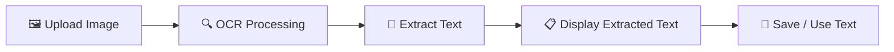

# Image2Text-AI

A lightweight and user-friendly OCR (Optical Character Recognition) application built with Python, Streamlit, and Docker. The application allows users to upload images containing text and automatically extract the text into an editable format.
The project demonstrates how computer vision, OCR, and containerization can be combined to build and deploy a practical document-processing application.

**Features**
•	📤 Upload image files through a Streamlit web interface

•	🔍 Extract text from images using OCR

•	📝 Display extracted text in an editable text area

•	📋 Easily copy or download extracted text

•	🖼️ Preview uploaded images

•	🐳 Fully containerized using Docker

•	⚡ Simple and lightweight Streamlit interface

•	🔧 Easy to run locally or inside a Docker container

•	📊 Suitable for documents, screenshots, scanned pages, receipts, and other text-based images


**Technology**	  **Purpose**

Python	        Application development

Streamlit	      Web application interface

OCR Engine	    Text extraction from images

Pillow      	  Image processing

Docker	        Application containerization

Git/GitHub	    Version control and source management


## 📁 Project Structure

```text
ocr-to-text/
│
├── app.py                    # Main OCR application
├── requirements.txt          # Python dependencies
├── Dockerfile                # Docker configuration
├── .dockerignore             # Docker build exclusions
├── .gitignore                # Git exclusions
├── README.md                 # Project documentation
│
├── images/
│   └── sample.png            # Sample image for OCR testing
│
└── tests/
    └── test_ocr.py           # OCR unit tests
```

    ## 🔄 Completed Workflow




**The application can be used for:**

Scanned documents

Screenshots

Receipts

Invoices

Forms

Notes

Business documents

Printed text

containing structured or unstructured text

**Future Enhancements**

**Potential improvements include:**

Support for PDF documents

Multi-page document OCR

Batch image processing

Table extraction

OCR confidence scoring

Searchable PDF generation
